<div align="center">
  <br/>
    
  <br/>
</div>

```python
class AboutMe:
    def __init__(self):
        self.name = "Dimka"
        self.education = "ITMO University"
        self.faculty = "Robotics and Artificial Intelligence"
        self.languages = ["Python", "C/C++", "Java"]

    def say_hello(self):
        print(self.name + " is ready to work!")
```
[check me out on Kaggle](https://www.kaggle.com/dmitryellison)
