<div align="center">
  <br/>
    
  <br/>
</div>

```python
class AboutMe:
    def __init__(self):
        self.name = "Dimka"
        self.education = "ITMO University"
        self.faculty = "Robotics and Artificial Intelligence"
        self.position = "Machine Learning Engineer"

    def say_hello(self):
        print(self.name + " is ready to work!")
```

---

#### ML
   

#### DevOps

     

----
<table width="100%">
  <tr>
    <td align="left">
      <a href="CV.pdf">
        
      </a>
    </td>
    <td align="right">
      
    </td>
  </tr>
</table>

